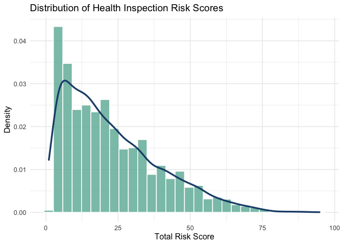
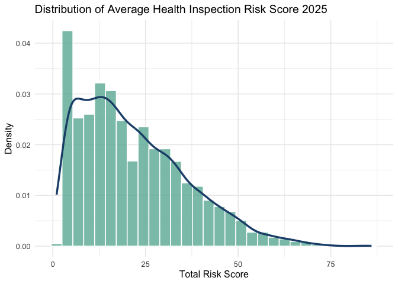

# West PA Health Inspections Analysis 2025
Mitchell Henschel

# Introduction

From 2014-2025, there were 404,513 health code violations across 90,066
inspections in Western PA. In 2025 alone, there were 28,777 violations
across 5,034 inspections.

Although the data is available to the public, there lacks a clear way to
view a summary of which restaurants had the most violations other than
individually downloading each inspection report. And even then, there
are codes on these reports that are not clearly explained.

As a local data scientist, I thought it would fun to come up with a
ranking system. There are 33 different violation categories that fall
into low, medium, or high risk (median risk was used for violations that
can vary in seriousness). The following weights were determined:

| VIOLATION | RISK | RISK_SCORE |
|:---|----|---:|
| Certified Food Protection Manager | HIGH | 5 |
| Handwashing Facilities | HIGH | 5 |
| Hot Holding Temperatures | MED | 3 |
| Pest Management | MED | 3 |
| Cross-Contamination Prevention | MED-LOW | 2 |
| Cold Holding Temperatures | MED | 3 |
| Probe-Type Thermometers | LOW | 1 |
| Cleaning and Sanitization | MED | 3 |
| Toxic Items | HIGH | 5 |
| Plumbing | HIGH | 5 |
| Consumer Advisory | HIGH | 5 |
| Facilities to Maintain Temperature | HIGH | 5 |
| Employee Personal Hygiene | MED | 3 |
| Food Source/Condition | MED | 3 |
| Waste Water Disposal | HIGH | 5 |
| Cooling Food | MED | 3 |
| Water Supply | HIGH | 5 |
| Demonstration of Knowledge | HIGH | 5 |
| Date Marking of Food | HIGH | 5 |
| Reheating Temperatures | MED | 3 |
| Employee Health | MED-LOW | 2 |
| Cooking Temperatures | MED | 3 |
| Contamination Prevention - Food, Utensils and Equipment | HIGH-MED | 4 |
| Toilet Room | HIGH-MED | 4 |
| Garbage and Refuse | HIGH-MED | 4 |
| Administrative | HIGH-MED | 4 |
| Fabrication, Design, Installation and Maintenance | HIGH-MED | 4 |
| Ventilation | HIGH-MED | 4 |
| Lighting | HIGH-MED | 4 |
| Floors | HIGH-MED | 4 |
| Walls and ceilings | HIGH-MED | 4 |
| Dressing rooms and Locker rooms | HIGH-MED | 4 |
| General Premises | HIGH-MED | 4 |

Full dataset available at:
https://data.wprdc.org/dataset/allegheny-county-restaurant-food-facility-inspection-violations



# Stats for Nerds

Distribution of calculated risk scores for all inspections:

| Percentile | RiskScore |
|:-----------|----------:|
| Min        |      1.00 |
| Q1         |      9.00 |
| Median     |     19.00 |
| Avg        |     22.85 |
| Q3         |     32.00 |
| Max        |     95.00 |

Risk Score Percentiles

The distribution of inspection scores is highly skewed.

To be fair to restaurants who scored better upon reinspection, I also
analyze the average risk score across all inspections in 2025.

| Percentile | RiskScore |
|:-----------|----------:|
| Min        |      1.00 |
| Q1         |     10.50 |
| Median     |     19.00 |
| Avg        |     21.84 |
| Q3         |     31.00 |
| Max        |     86.00 |

Average Risk Score Percentiles

A very similar distribution is observed for average health inspection
score.

I would consider the median score of 19 as the ‘clean’ threshold, and
the Q3 of 32 to be the ‘acceptable’ threshold.

# WALL OF SHAME 2025

Click on the restaurant name to view the full health inspection report.

## By Inspection

| Location | Date | Risk Score | \# Violations | \# High Risk |
|:---|:---|---:|---:|---:|
| [Lucca Ristorante & Wine Bar - Craig Street, Pittsburgh](http://appsrv.alleghenycounty.us/reports/rwservlet?food_rep_insp&P_ENCOUNTER=202507010017) | 2025-07-01 | 95 | 24 | 8 |
| [Jay’s Other Place - Route 8, Allison Park](http://appsrv.alleghenycounty.us/reports/rwservlet?food_rep_insp&P_ENCOUNTER=202505210039) | 2025-05-21 | 90 | 22 | 7 |
| [Diners 2+1 - Murray Avenue, Pittsburgh](http://appsrv.alleghenycounty.us/reports/rwservlet?food_rep_insp&P_ENCOUNTER=202503180044) | 2025-03-18 | 89 | 23 | 7 |
| [Hastina Royal Indian Cuisine - Park Manor Boulevard, Pittsburgh](http://appsrv.alleghenycounty.us/reports/rwservlet?food_rep_insp&P_ENCOUNTER=202506110018) | 2025-06-11 | 88 | 22 | 8 |
| [Shannopin Country Club Restaurant - Windmere Rd, Pittsburgh](http://appsrv.alleghenycounty.us/reports/rwservlet?food_rep_insp&P_ENCOUNTER=202507150047) | 2025-07-15 | 86 | 22 | 7 |
| [Nepali Asian Restaurant - Brownsville Road, Pittsburgh](http://appsrv.alleghenycounty.us/reports/rwservlet?food_rep_insp&P_ENCOUNTER=202501090031) | 2025-01-09 | 84 | 22 | 7 |
| [Fired Up Brick Oven Taphouse - Noblestown Road, Pittsburgh](http://appsrv.alleghenycounty.us/reports/rwservlet?food_rep_insp&P_ENCOUNTER=202502190048) | 2025-02-19 | 84 | 21 | 6 |
| [Fun Asian Bistro - Frankstown Road, Pittsburgh](http://appsrv.alleghenycounty.us/reports/rwservlet?food_rep_insp&P_ENCOUNTER=202507010031) | 2025-07-01 | 83 | 21 | 6 |
| [The Mintt - Banksville Road, Pittsburgh](http://appsrv.alleghenycounty.us/reports/rwservlet?food_rep_insp&P_ENCOUNTER=202504210035) | 2025-04-21 | 81 | 21 | 7 |
| [The Library - Carson Street, Pittsburgh](http://appsrv.alleghenycounty.us/reports/rwservlet?food_rep_insp&P_ENCOUNTER=202503180056) | 2025-03-18 | 80 | 20 | 6 |

Top 10 inspections by risk score

| Location | Date | Risk Score | \# Violations | \# High Risk |
|:---|:---|---:|---:|---:|
| [Lucca Ristorante & Wine Bar - Craig Street, Pittsburgh](http://appsrv.alleghenycounty.us/reports/rwservlet?food_rep_insp&P_ENCOUNTER=202507010017) | 2025-07-01 | 95 | 24 | 8 |
| [Hastina Royal Indian Cuisine - Park Manor Boulevard, Pittsburgh](http://appsrv.alleghenycounty.us/reports/rwservlet?food_rep_insp&P_ENCOUNTER=202506110018) | 2025-06-11 | 88 | 22 | 8 |
| [K Asian Bistro Sushi Bar - Route 8, Allison Park](http://appsrv.alleghenycounty.us/reports/rwservlet?food_rep_insp&P_ENCOUNTER=202502280026) | 2025-02-28 | 79 | 20 | 8 |
| [Cousins Maine Lobster Commissary - William Flynn Highway, Gibsonia](http://appsrv.alleghenycounty.us/reports/rwservlet?food_rep_insp&P_ENCOUNTER=202506050017) | 2025-06-05 | 77 | 19 | 8 |
| [Our Little Secret Cafe and Catering - Curry Hollow Road, Pittsburgh](http://appsrv.alleghenycounty.us/reports/rwservlet?food_rep_insp&P_ENCOUNTER=202502110007) | 2025-02-11 | 73 | 18 | 8 |
| [Jay’s Other Place - Route 8, Allison Park](http://appsrv.alleghenycounty.us/reports/rwservlet?food_rep_insp&P_ENCOUNTER=202505210039) | 2025-05-21 | 90 | 22 | 7 |
| [Diners 2+1 - Murray Avenue, Pittsburgh](http://appsrv.alleghenycounty.us/reports/rwservlet?food_rep_insp&P_ENCOUNTER=202503180044) | 2025-03-18 | 89 | 23 | 7 |
| [Shannopin Country Club Restaurant - Windmere Rd, Pittsburgh](http://appsrv.alleghenycounty.us/reports/rwservlet?food_rep_insp&P_ENCOUNTER=202507150047) | 2025-07-15 | 86 | 22 | 7 |
| [Nepali Asian Restaurant - Brownsville Road, Pittsburgh](http://appsrv.alleghenycounty.us/reports/rwservlet?food_rep_insp&P_ENCOUNTER=202501090031) | 2025-01-09 | 84 | 22 | 7 |
| [The Mintt - Banksville Road, Pittsburgh](http://appsrv.alleghenycounty.us/reports/rwservlet?food_rep_insp&P_ENCOUNTER=202504210035) | 2025-04-21 | 81 | 21 | 7 |

Top 10 inspections by number of high risk violations

## Overall Yearly

| Location | Year | Risk Score | \# Inspections | Average Risk | \# Violations |
|:---|---:|---:|---:|---:|---:|
| [Shannopin Country Club Restaurant - Windmere Rd, Pittsburgh](http://appsrv.alleghenycounty.us/reports/rwservlet?food_rep_insp&P_ENCOUNTER=202507150047) | 2025 | 86 | 1 | 86 | 22 |
| [Fun Asian Bistro - Frankstown Road, Pittsburgh](http://appsrv.alleghenycounty.us/reports/rwservlet?food_rep_insp&P_ENCOUNTER=202507010031) | 2025 | 83 | 1 | 83 | 21 |
| [Zen Asian Diner - Butler Street, Pittsburgh](http://appsrv.alleghenycounty.us/reports/rwservlet?food_rep_insp&P_ENCOUNTER=202507140064) | 2025 | 76 | 1 | 76 | 19 |
| [Angkor - Noblestown Road, Pittsburgh](http://appsrv.alleghenycounty.us/reports/rwservlet?food_rep_insp&P_ENCOUNTER=202503040029) | 2025 | 73 | 1 | 73 | 18 |
| [Hastina Royal Indian Cuisine - Park Manor Boulevard, Pittsburgh](http://appsrv.alleghenycounty.us/reports/rwservlet?food_rep_insp&P_ENCOUNTER=202506110018) | 2025 | 146 | 2 | 73 | 36 |
| [Shop ’n Save / Russellton - Little Deer Creek Valley Road, Russellton](http://appsrv.alleghenycounty.us/reports/rwservlet?food_rep_insp&P_ENCOUNTER=202507220025) | 2025 | 72 | 1 | 72 | 18 |
| [Sambok Korean Grocery - Penn Avenue, Pittsburgh](http://appsrv.alleghenycounty.us/reports/rwservlet?food_rep_insp&P_ENCOUNTER=202501030016) | 2025 | 71 | 1 | 71 | 18 |
| [Pauline’s Caribbean Soul Cuisine - Federal Street, Pittsburgh](http://appsrv.alleghenycounty.us/reports/rwservlet?food_rep_insp&P_ENCOUNTER=202506090034) | 2025 | 71 | 1 | 71 | 17 |
| [Porky’s Bar & Grill - Bridge Street, Pittsburgh](http://appsrv.alleghenycounty.us/reports/rwservlet?food_rep_insp&P_ENCOUNTER=202506170017) | 2025 | 70 | 1 | 70 | 18 |
| [Rear End Gastropub & Garage - Butler Street, Pittsburgh](http://appsrv.alleghenycounty.us/reports/rwservlet?food_rep_insp&P_ENCOUNTER=202506170044) | 2025 | 69 | 1 | 69 | 17 |

Top 10 restaurants by average risk score in 2025

| Location | Year | Risk Score | \# Inspections | Average Risk | \# Violations |
|:---|---:|---:|---:|---:|---:|
| [Ritik’s Market on Smithfield - Smithfield Street, Pittsburgh](http://appsrv.alleghenycounty.us/reports/rwservlet?food_rep_insp&P_ENCOUNTER=202503190043) | 2025 | 102 | 6 | 17.00 | 23 |
| [Enson Market - Thomas Boulevard, Pittsburgh](http://appsrv.alleghenycounty.us/reports/rwservlet?food_rep_insp&P_ENCOUNTER=202504300036) | 2025 | 212 | 6 | 35.33 | 57 |
| [Houlihan’s - Washington Road, Pittsburgh](http://appsrv.alleghenycounty.us/reports/rwservlet?food_rep_insp&P_ENCOUNTER=202501080030) | 2025 | 99 | 5 | 19.80 | 26 |
| [Dunkin Donuts \#350871 - 5th Avenue, Mc Keesport](http://appsrv.alleghenycounty.us/reports/rwservlet?food_rep_insp&P_ENCOUNTER=202501170038) | 2025 | 101 | 5 | 20.20 | 26 |
| [Chuan Xiang Hui - Atwood Street, Pittsburgh](http://appsrv.alleghenycounty.us/reports/rwservlet?food_rep_insp&P_ENCOUNTER=202502040018) | 2025 | 259 | 5 | 51.80 | 65 |
| [Cash & Carry Convenience Store - Saltsburg Road, Pittsburgh](http://appsrv.alleghenycounty.us/reports/rwservlet?food_rep_insp&P_ENCOUNTER=202502260031) | 2025 | 58 | 5 | 11.60 | 14 |
| [RIVAL Restaurant & Sports Bar - Freeport Road, Pittsburgh](http://appsrv.alleghenycounty.us/reports/rwservlet?food_rep_insp&P_ENCOUNTER=202502270048) | 2025 | 152 | 5 | 30.40 | 39 |
| [Diners 2+1 - Murray Avenue, Pittsburgh](http://appsrv.alleghenycounty.us/reports/rwservlet?food_rep_insp&P_ENCOUNTER=202503180044) | 2025 | 190 | 5 | 38.00 | 49 |
| [TJ Buffet Sushi & Grill - Pittsburgh Mills Circle, Tarentum](http://appsrv.alleghenycounty.us/reports/rwservlet?food_rep_insp&P_ENCOUNTER=202501020025) | 2025 | 63 | 4 | 15.75 | 17 |
| [Dunkin Donuts \#348700 - Forbes Avenue, Pittsburgh](http://appsrv.alleghenycounty.us/reports/rwservlet?food_rep_insp&P_ENCOUNTER=202501070013) | 2025 | 75 | 4 | 18.75 | 19 |

Top 10 restaurants by number of inspections in 2025

| Location | Year | Risk Score | \# Inspections | Average Risk | \# Violations |
|:---|---:|---:|---:|---:|---:|
| [Chuan Xiang Hui - Atwood Street, Pittsburgh](http://appsrv.alleghenycounty.us/reports/rwservlet?food_rep_insp&P_ENCOUNTER=202502040018) | 2025 | 259 | 5 | 51.80 | 65 |
| [Enson Market - Thomas Boulevard, Pittsburgh](http://appsrv.alleghenycounty.us/reports/rwservlet?food_rep_insp&P_ENCOUNTER=202504300036) | 2025 | 212 | 6 | 35.33 | 57 |
| [Diners 2+1 - Murray Avenue, Pittsburgh](http://appsrv.alleghenycounty.us/reports/rwservlet?food_rep_insp&P_ENCOUNTER=202503180044) | 2025 | 190 | 5 | 38.00 | 49 |
| [Popeye’s Louisiana Kitchen - William Penn Highway, Pittsburgh](http://appsrv.alleghenycounty.us/reports/rwservlet?food_rep_insp&P_ENCOUNTER=202501230027) | 2025 | 168 | 4 | 42.00 | 44 |
| [Yukiyama - Murray Avenue, Pittsburgh](http://appsrv.alleghenycounty.us/reports/rwservlet?food_rep_insp&P_ENCOUNTER=202504220039) | 2025 | 176 | 3 | 58.67 | 44 |
| [La Nova Pizzeria - Pittsburgh Street, Springdale](http://appsrv.alleghenycounty.us/reports/rwservlet?food_rep_insp&P_ENCOUNTER=202502200029) | 2025 | 173 | 3 | 57.67 | 42 |
| [Tramps - Greentree Road, Pittsburgh](http://appsrv.alleghenycounty.us/reports/rwservlet?food_rep_insp&P_ENCOUNTER=202505060011) | 2025 | 174 | 3 | 58.00 | 42 |
| [K Asian Bistro Sushi Bar - Route 8, Allison Park](http://appsrv.alleghenycounty.us/reports/rwservlet?food_rep_insp&P_ENCOUNTER=202502280026) | 2025 | 156 | 4 | 39.00 | 40 |
| [RIVAL Restaurant & Sports Bar - Freeport Road, Pittsburgh](http://appsrv.alleghenycounty.us/reports/rwservlet?food_rep_insp&P_ENCOUNTER=202502270048) | 2025 | 152 | 5 | 30.40 | 39 |
| [T’s Lounge & Restaurant - Center Street, Pittsburgh](http://appsrv.alleghenycounty.us/reports/rwservlet?food_rep_insp&P_ENCOUNTER=202501230041) | 2025 | 155 | 3 | 51.67 | 38 |

Top 10 restaurants by total violations in 2025

# Discussion

Just from skimming some of these reports, here’s some of my favorite
excerpts:

**Lucca Ristorante & Wine Bar, Craig St, 07/01/2025:**

- There are bottles of liquor stored beneath and contaminated by an
  unknown water source from the active ceiling leak behind the bar. The
  operator voluntarily moved the affected bottles to a safe storage
  location and discontinued service behind the bar.

**The Library, Carson St, 03/08/2025:**

- Numerous rodent droppings \[in 6 areas\]… Nesting material was
  identified \[in 4 areas\]… Loose bait found in kitchen and basement.

- Black mold-like substance and a pink biofilm was identified on the ice
  machine deflector plate and surrounding areas.

- Oyster and chicken breading preparation cooler interior has excessive
  amounts of old food debris.

- It was discovered that the dish machine is not functioning properly
  and is failing to sanitize effectively. The chlorine readout measured
  at 0.00 PPM. Owner initiated a phone call for repairs.

**Zen Asian Diner, Butler St, 07/14/2025**

- In basement, there is a decayed corpse of an animal, about the size of
  a possum or large rat. Unable to determine the type of animal during
  inspection.

- Too many flies to count found throughout all food preparation areas of
  entire facility.

- The garage that holds the dumpster and grease receptacle has a door
  that leads directly into the food preparation room and that door does
  not seal.

*REPEAT VIOLATIONS*

**Fun Asian Bistro, Frankstown Rd, 07/01/2025**

- Did not observe any employee handwashing during inspection.

- Employee observed eating on cookline.

- Temperature/Time Controlled for Safety (TCS) foods such as tofu, beef,
  chicken, cooked noodles, and cooked rice were found between 45-55F in
  the two-door and three-door prep coolers. All foods discarded.

- Cooked chicken by grill had a temperature of 75F. Owner says it was
  cooked this morning. Discarded during inspection. *REPEAT VIOLATION*

**Hastina Royal Indian Cuisine, Park Manor Boulevard, 06/11/2025**

- Facility is open and operating without a valid health permit.

- Facility failed to submit plans for a change of ownership and transfer
  of a sister LLC.

- Consumer alert administered during inspection due to several high and
  medium risk violations.

**The Mintt, Banksville Rd, 04/21/2025**

- In the walk-in cooler, a container of raw lamb was observed stored
  behind a loosely covered bowl of dough. Blood was observed to have
  dripped onto plastic wrap covering a bowl of pudding.

------------------------------------------------------------------------

Health inspections are merely a snapshot of how a restaurant is
operating at a specific point in time, not a permanent verdict. Most
violations are trivial mistakes that we could make in our own kitchen.
However, if serious violations are repeated then restaurants should be
held accountable. Stay informed and grab the inspection report before
hitting the buffet.

Questions and suggestions on my methodology are welcome. Thanks for
reading!

[Source
code](https://github.com/Elkip/West-PA-Health-Inspection-Analysis/tree/master)

[Google Sheets With All Data](https://drive.google.com)

#### Written by a human, with no use of AI \<3
